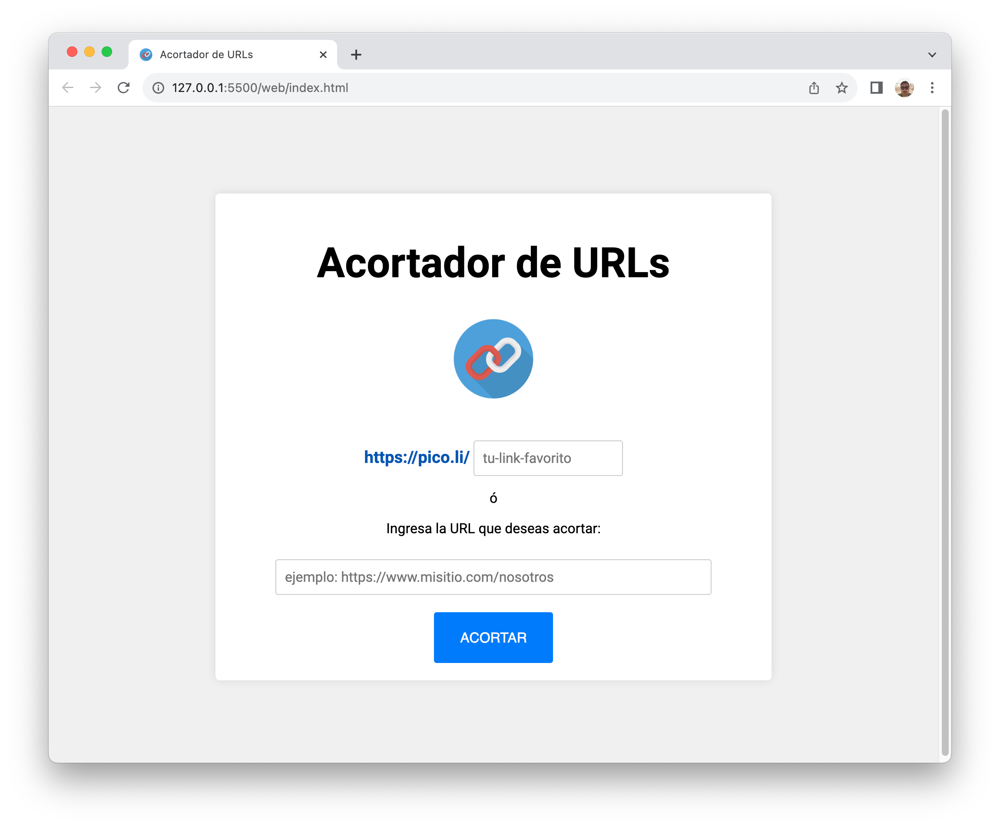
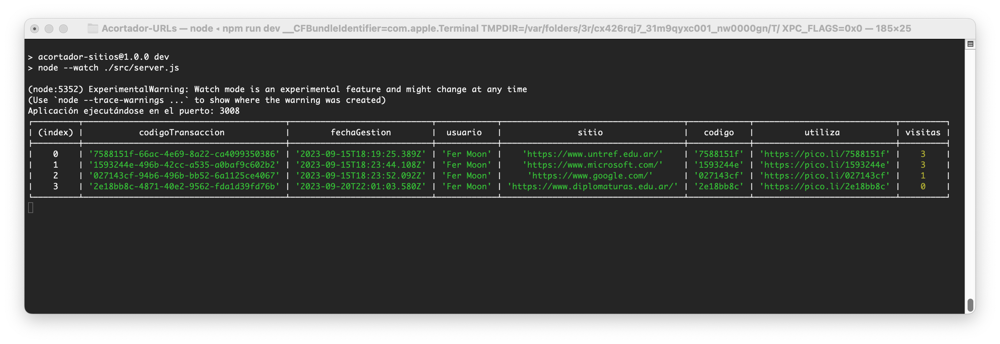

# Proyecto PICO-LI

El objetivo de este proyecto es generar el backend de una aplicación web acortadora de direcciones (URLs).



El usuario ingresará una sitio parcial o total que requiere acortar, por ejemplo: `www.misitioweb.com`, y el sistema le retornará la sitio acortada utilizando la estructura: `https://pico.li/abc123de`.

El mismo usuario contará con la posibilidad de verificar si un texto corto, modelo, está disponible para ser utilizado como acortador. Ejemplo: `untref`

De estar disponible, el sistema debe utilizar este modelo para generar la sitio correspondiente. La misma debería quedar con la siguiente estructura: `https://pico.li/untref`.
<br>
<br>

## Estructura de datos a guardar

Utilizaremos como base de datos, un archivo JSON local, al cual accederemos mediante **fileSystem**, módulo nativo de Node.js: `fs`.
<br>
<br>

## Código identificador de sitios acortadas

Implementaremos el mecanismo de generación de códigos `uuid v4.0`. El mismo se puede implementar a través de la dependencia `uuidv4`.

El código de transacción obtenido por **UUID** para cada sitio acortado que se gestione, se utilizará para obtener el código de sitio acortada. Se tomará de este la primera parte, que consta de 8 caracteres alfanuméricos.
<br>
<br>

### Ejemplo:
Si el UUID es: `0f68a89e-dc0e-48fd-baea-28a8ee4c4731`

El código de sitio acortada será: `/0f68a89e`

Para las URLs acortadas según el modelo ingresado por el usuario en el campo `/tu-link-favorito`, utilizarán ese mismo modelo. Aún así obtendrán un **UUID** que los identifique dentro del sistema. 

De forma similar al UUID que genera **MongoDB** o el código autonumérico que genera **SQL**.
<br>
<br>

## ENDPOINTS

Los endpoints a crear son los siguientes:


| MÉTODO | ENDPOINT           | DESCRIPCIÓN |
|--------|--------------------|-------------|
| GET    | `/:codigo`| La URL base redireccionará el código que llegue como parámetro al sitio web que le corresponde, e incrementa su propiedad `visitas` en un dígito. Si no existe el código, mostrará un error de recurso no encontrado.|
| GET    | `/validar/:tulink`| Este endpoint valida si existe o no un link personal para poder utilizarlo. Retorna un mensaje de confirmación o un mensaje de error si no está disponible.|
| POST   | `/acorta`| Esta URL recibe un JSON en el cuerpo de la petición, con el usuario y la URL que se debe acortar. Retornará el JSON completo con la URL acortada.|
| GET    | `/database`| Retornará un JSON con la información de toda la base de datos de direcciones acortadas. Es para **uso técnico / administrativo**.|
<br>
<br>

# Acortar URLs ("/acorta")

El endpoint `/acortar` recibe una estructura de datos y acorta la URL, retornando como respuesta la información de la URL ingresada, la URL acortada, y fecha y hora de la realización de este proceso, un código de transacción y ajusta la propiedad `visitas` con el valor 0.

### Cuerpo para el método POST 

El siguiente código de ejemplo, es el que recibe el endpoint `/acorta`.

```json
{
    "user": "Fer Moon",
    "url": "https://www.urlquequieresacortar.com/ruta/documento.html"
}
```
<br>

Si el usuario agregó y validó su link personalizado, el endpoint `/acorta` recibe la siguiente estructura de datos:

```json
{
    "tulink": "Cust0mL1nk",
    "user": "Fer Moon",
    "url": "https://www.urlquequieresacortar.com/ruta/documento.html"
}
```
<br>

### Respuesta del servidor (201)
La estructura de datos que éste almacenará, y con la cual responderá la petición exitosa, es similar a la siguiente:

```json
{
    "codigoTransaccion": "bfed42cc-af63-45d6-a627-663b4a765db6",
    "fechaGestion": "2023-09-21T01:44:41.740Z",
    "usuario": "Fer Moon",
    "sitio": "https://www.diplomaturas2024.edu.ar/",
    "codigo": "bfed42cc",
    "utiliza": "https://pico.li/bfed42cc",
    "visitas": 0
}
```

Si **el usuario gestionó su propio link**, la petición exitosa responderá con la siguiente estructura:

```json
{
    "codigoTransaccion": "bfed42cc-af63-45d6-a627-663b4a765db6",
    "fechaGestion": "2023-09-21T01:44:41.740Z",
    "usuario": "Fer Moon",
    "sitio": "https://www.diplomaturas2024.edu.ar/",
    "codigo": "Cust0mL1nk",
    "utiliza": "https://pico.li/Cust0mL1nk",
    "visitas": 0
}
```
<br>

### Respuesta del servidor (400)
Ante un error en la generación de la URL acortada, retornará el siguiente error:

```json
{
    error: 400, 
    message: "Los datos enviados son incorrectos."
}
```
<br>

### Respuesta del servidor (500)
Si ocurre un error de servidor, retornará el siguiente error:

```json
{
    error: 500, 
    message: "Se ha producido un error el intentar acortar la sitio."
}
```
<br>
<br>

# Validar existencia de un link ("/validar")

Este endpoint valida si un código personalizado ha sido o no asociado a algún sitio web.

## parámetro esperado :tu-link

Este método espera como parámetro un valor numérico, alfanumérico, o alfabético.

**Ejemplo:**

```curl
    http://localhost:3008/validar/mi-link
```
<br>

### Respuesta del servidor (200)
Si el código está libre para su uso, retornará la siguiente respuesta:

```json
{
  "codigo": 200,
  "mensaje": "El link ingresado está disponible para su uso."
}
```
<br>

### Respuesta del servidor (409)
Si el código ha sido ocupado previamente, retornará la siguiente respuesta:
```json
{
    codigo: 409, 
    mensaje: "El link ingresado no se encuentra disponible."
}
```
<br>

### Respuesta del servidor (400)
Si el código enviado como parámetro tiene menos de 6 caracteres o más de 10 caracteres, retornará la siguiente respuesta:
```json
{
    error: 400, 
    message: "Los links deben contener entre 6 y 10 caracteres."
}
```
<br>

# Consultar la base de datos ("/database")
Esto es solo un proceso administrativo el cual permite consultar la base de datos (JSON) donde se almacenan los diferentes sitios con URL acortada.

Retornará un JSON con toda la información. En la ventana `Terminal` visualizará una tabla con toda la información.

